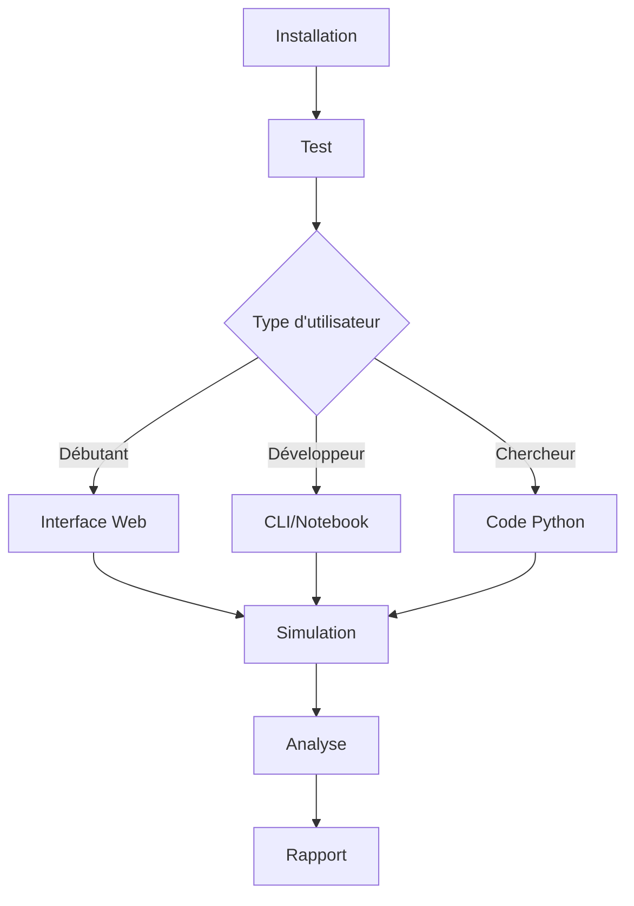

# 🛠️ EV2Gym - Vue d'Ensemble des Outils

Ce document présente tous les outils créés pour faciliter l'utilisation d'EV2Gym.

## 📦 Structure des Outils Créés

```
ev2gym/
├── 📁 tools/                    # Outils principaux
│   ├── demo.py                  # Script de démonstration
│   ├── cli.py                   # Interface CLI interactive
│   ├── web_app.py              # Interface web Streamlit
│   └── analysis.py             # Outils d'analyse
├── 📁 notebooks/               # Notebooks Jupyter
│   └── EV2Gym_Demo.ipynb       # Démonstration interactive
├── 📄 run_ev2gym.py            # Script de lancement principal
├── 📄 install.py               # Installation automatique
├── 📄 setup.py                 # Configuration du package
├── 📄 requirements.txt         # Dépendances
├── 📄 README.md                # Documentation principale
├── 📄 QUICKSTART.md            # Guide de démarrage rapide
└── 📄 .gitignore               # Fichiers à ignorer
```

## 🚀 Point d'Entrée Principal

### `run_ev2gym.py` - Lanceur Universel
**Usage :** `python run_ev2gym.py <commande> [options]`

| Commande | Description | Exemple |
|----------|-------------|---------|
| `demo` | Script de démonstration | `python run_ev2gym.py demo --config V2GProfitMax` |
| `cli` | Interface CLI interactive | `python run_ev2gym.py cli` |
| `web` | Interface web Streamlit | `python run_ev2gym.py web` |
| `notebook` | Notebook Jupyter | `python run_ev2gym.py notebook` |
| `analyze` | Outils d'analyse | `python run_ev2gym.py analyze --compare_agents` |
| `install` | Installation automatique | `python run_ev2gym.py install` |
| `test` | Test de l'installation | `python run_ev2gym.py test` |

## 🎯 Outils Individuels

### 1. 📊 `tools/demo.py` - Script de Démonstration
**Objectif :** Première prise en main et tests rapides

**Fonctionnalités :**
- ✅ Simulation avec différents agents (random, fast, smart, heuristic)
- ✅ Configuration via paramètres de ligne de commande
- ✅ Agents intelligents intégrés (SimpleAgents)
- ✅ Affichage des résultats en temps réel
- ✅ Sauvegarde optionnelle des résultats

**Usage :**
```bash
# Simulation basique
python tools/demo.py --config V2GProfitMax --agent smart --steps 100

# Avec visualisation
python tools/demo.py --config PublicPST --agent heuristic --visualize --save
```

### 2. 💻 `tools/cli.py` - Interface CLI Interactive
**Objectif :** Configuration et lancement interactif de simulations

**Fonctionnalités :**
- ✅ Sélection interactive des scénarios
- ✅ Configuration des paramètres de simulation
- ✅ Modification des fichiers YAML en temps réel
- ✅ Mode comparaison d'agents automatique
- ✅ Sauvegarde de configurations personnalisées

**Usage :**
```bash
# Mode interactif
python tools/cli.py

# Mode comparaison
python tools/cli.py --batch
```

### 3. 🌐 `tools/web_app.py` - Interface Web Streamlit
**Objectif :** Interface graphique intuitive pour utilisateurs non-techniques

**Fonctionnalités :**
- ✅ Interface web moderne et responsive
- ✅ Configuration graphique des paramètres
- ✅ Visualisations interactives avec Plotly
- ✅ Métriques en temps réel
- ✅ Graphiques de consommation d'énergie
- ✅ Analyse des stations de charge

**Usage :**
```bash
streamlit run tools/web_app.py
# Puis ouvrir http://localhost:8501
```

### 4. 📊 `tools/analysis.py` - Outils d'Analyse
**Objectif :** Analyse approfondie des résultats et comparaison d'agents

**Fonctionnalités :**
- ✅ Analyse de simulations individuelles
- ✅ Comparaison automatique d'agents
- ✅ Métriques d'efficacité énergétique
- ✅ Analyse des contraintes et violations
- ✅ Génération de rapports automatiques
- ✅ Graphiques d'analyse avancés
- ✅ Export des résultats (CSV, PNG)

**Usage :**
```bash
# Analyser un replay
python tools/analysis.py --replay_path ./replay/sim.pkl --generate_report

# Comparer des agents
python tools/analysis.py --compare_agents --config V2GProfitMax
```

### 5. 📓 `notebooks/EV2Gym_Demo.ipynb` - Notebook Jupyter
**Objectif :** Démonstration interactive et éducative

**Fonctionnalités :**
- ✅ Guide pas-à-pas avec explications
- ✅ Exemples de code commentés
- ✅ Visualisations intégrées
- ✅ Comparaison d'agents interactive
- ✅ Analyse des résultats en temps réel

**Usage :**
```bash
jupyter notebook notebooks/EV2Gym_Demo.ipynb
```

## ⚙️ Outils d'Installation et Configuration

### 6. 🔧 `install.py` - Installation Automatique
**Objectif :** Installation guidée et vérification des dépendances

**Fonctionnalités :**
- ✅ Vérification de la version Python
- ✅ Installation des dépendances par type (minimal, standard, complet)
- ✅ Création des répertoires nécessaires
- ✅ Test automatique de l'installation
- ✅ Guide des prochaines étapes

**Types d'installation :**
- **Minimal** : Dépendances de base uniquement
- **Standard** : + outils de visualisation
- **Complet** : + RL, web, Jupyter

### 7. 📦 `setup.py` - Configuration du Package
**Objectif :** Installation via pip et distribution

**Fonctionnalités :**
- ✅ Installation en mode développement (`pip install -e .`)
- ✅ Dépendances optionnelles par catégorie
- ✅ Points d'entrée pour les commandes console
- ✅ Inclusion des fichiers de données

### 8. 📋 `requirements.txt` - Gestion des Dépendances
**Objectif :** Spécification des versions des packages

**Catégories :**
- **Core** : gymnasium, numpy, pandas, matplotlib, yaml
- **Optimization** : gurobipy (licence requise)
- **ML** : torch, stable-baselines3
- **Web** : streamlit, dash, plotly
- **Dev** : jupyter, pytest

## 📚 Documentation

### 9. 📖 `README.md` - Documentation Principale
**Contenu :**
- ✅ Vue d'ensemble du projet
- ✅ Instructions d'installation détaillées
- ✅ Guide d'utilisation complet
- ✅ Exemples de code
- ✅ Configuration personnalisée
- ✅ Architecture du système

### 10. 🚀 `QUICKSTART.md` - Guide de Démarrage Rapide
**Contenu :**
- ✅ Installation express
- ✅ Premier test en 5 minutes
- ✅ Exemples d'utilisation courants
- ✅ Résolution de problèmes

## 🎯 Flux d'Utilisation Recommandé

### Pour les Débutants
1. **Installation** : `python install.py`
2. **Test** : `python run_ev2gym.py test`
3. **Première simulation** : `python run_ev2gym.py demo`
4. **Interface graphique** : `python run_ev2gym.py web`

### Pour les Développeurs
1. **Installation complète** : `python install.py --full`
2. **Notebook de démonstration** : `python run_ev2gym.py notebook`
3. **Interface CLI** : `python run_ev2gym.py cli`
4. **Analyse avancée** : `python run_ev2gym.py analyze --compare_agents`

### Pour les Chercheurs
1. **Configuration personnalisée** : Modifier les fichiers YAML
2. **Agents personnalisés** : Implémenter dans `rl_agent/`
3. **Analyse approfondie** : `tools/analysis.py`
4. **Intégration RL** : Stable-Baselines3

## 🔄 Workflow Typique



## 🎉 Avantages de cette Suite d'Outils

### ✅ **Accessibilité**
- Interface web pour non-programmeurs
- CLI pour utilisateurs techniques
- Notebooks pour apprentissage

### ✅ **Flexibilité**
- Configurations prêtes à l'emploi
- Personnalisation complète possible
- Intégration RL native

### ✅ **Productivité**
- Installation automatique
- Comparaison d'agents en un clic
- Analyse automatique des résultats

### ✅ **Extensibilité**
- Architecture modulaire
- Agents personnalisés faciles à ajouter
- Fonctions de récompense configurables

---

**Cette suite d'outils transforme EV2Gym en une plateforme complète et accessible pour la recherche en recharge intelligente de véhicules électriques ! 🚗⚡**
